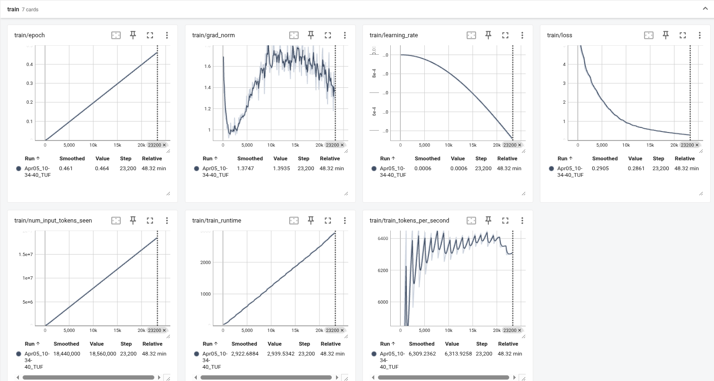
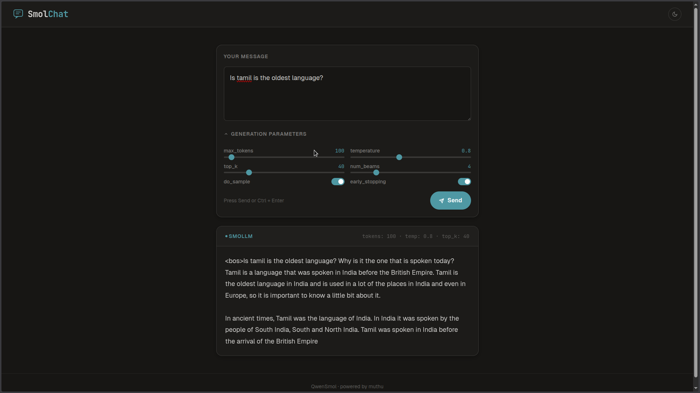

# FemtoGPT
A tiny, super-minimal chat model built from scratch — tokenizer → transformer → training (base-model) → Inference API .

> Goal: Understand and implement every core component of an LLM pipeline in the simplest possible way.

## Features
- Custom **BPE tokenizer** (no external tokenizer dependency)
- Minimal **Transformer architecture** (RMSNorm, RoPE, SwiGLU)
- Lightweight **80M parameter model**
- Hugging Face **Trainer-based training pipeline**
- Simple **web chat UI**
- Dockerized setup for easy deployment

```mermaid
flowchart TD

subgraph group_core["Core library"]
  node_femto["femto<br/>python package"]
  node_fconfig["Config<br/>[fconfig.py]"]
  node_fdataset["Dataset<br/>data module<br/>[fdataset.py]"]
  node_fmodel{{"Transformer<br/>model module<br/>[fmodel.py]"}}
  node_fcallback["Callbacks<br/>trainer hooks<br/>[fcallback.py]"]
  node_feval["Eval<br/>[feval.py]"]
  node_fhelper["Helpers<br/>utility module<br/>[fhelper.py]"]
  node_basics["Basics<br/>primitives module<br/>[basics.py]"]
end

subgraph group_pipeline["Offline pipeline"]
  node_train["Train<br/>[train.py]"]
  node_pred["Generate<br/>inference script<br/>[pred.py]"]
end

subgraph group_apps["Serving apps"]
  node_backend["Backend<br/>serving app<br/>[main.py]"]
  node_frontend["Frontend<br/>static ui<br/>[index.html]"]
  node_gradio["Gradio<br/>demo app<br/>[main.py]"]
  node_compose["Compose<br/>deployment spec<br/>[docker-compose.yml]"]
end

subgraph group_artifacts["Artifacts"]
  node_trainer_output[("Trainer output<br/>artifacts dir")]
  node_assets["Assets"]
  node_notebooks["Notebooks<br/>analysis workspace"]
  node_misc["Misc<br/>prototype scripts"]
end

node_femto -->|"contains"| node_fconfig
node_femto -->|"contains"| node_fdataset
node_femto -->|"contains"| node_fmodel
node_femto -->|"contains"| node_fcallback
node_femto -->|"contains"| node_feval
node_femto -->|"contains"| node_fhelper
node_femto -->|"contains"| node_basics
node_train -->|"uses"| node_fdataset
node_train -->|"uses"| node_fmodel
node_train -->|"uses"| node_fcallback
node_train -->|"uses"| node_feval
node_train -->|"writes"| node_trainer_output
node_pred -->|"loads"| node_fmodel
node_pred -->|"uses"| node_fhelper
node_backend -->|"serves"| node_fmodel
node_backend -.->|"aligns with"| node_pred
node_frontend -->|"calls"| node_backend
node_gradio -->|"serves"| node_fmodel
node_compose -->|"orchestrates"| node_backend
node_compose -->|"orchestrates"| node_frontend
node_compose -->|"orchestrates"| node_gradio
node_assets -.->|"documents"| node_frontend
node_notebooks -.->|"explores"| node_fdataset
node_misc -.->|"supports"| node_pred

click node_femto "https://github.com/muthukamalan/femtogpt/tree/main/femto"
click node_fconfig "https://github.com/muthukamalan/femtogpt/blob/main/femto/fconfig.py"
click node_fdataset "https://github.com/muthukamalan/femtogpt/blob/main/femto/fdataset.py"
click node_fmodel "https://github.com/muthukamalan/femtogpt/blob/main/femto/fmodel.py"
click node_fcallback "https://github.com/muthukamalan/femtogpt/blob/main/femto/fcallback.py"
click node_feval "https://github.com/muthukamalan/femtogpt/blob/main/femto/feval.py"
click node_fhelper "https://github.com/muthukamalan/femtogpt/blob/main/femto/fhelper.py"
click node_basics "https://github.com/muthukamalan/femtogpt/blob/main/femto/basics.py"
click node_train "https://github.com/muthukamalan/femtogpt/blob/main/train.py"
click node_pred "https://github.com/muthukamalan/femtogpt/blob/main/pred.py"
click node_backend "https://github.com/muthukamalan/femtogpt/blob/main/app/backend/main.py"
click node_frontend "https://github.com/muthukamalan/femtogpt/blob/main/app/frontend/index.html"
click node_gradio "https://github.com/muthukamalan/femtogpt/blob/main/app/gradio/main.py"
click node_compose "https://github.com/muthukamalan/femtogpt/blob/main/docker-compose.yml"
click node_trainer_output "https://github.com/muthukamalan/femtogpt/tree/main/trainer_output"
click node_assets "https://github.com/muthukamalan/femtogpt/tree/main/assets"
click node_notebooks "https://github.com/muthukamalan/femtogpt/tree/main/notebooks"
click node_misc "https://github.com/muthukamalan/femtogpt/tree/main/misc"

classDef toneNeutral fill:#f8fafc,stroke:#334155,stroke-width:1.5px,color:#0f172a
classDef toneBlue fill:#dbeafe,stroke:#2563eb,stroke-width:1.5px,color:#172554
classDef toneAmber fill:#fef3c7,stroke:#d97706,stroke-width:1.5px,color:#78350f
classDef toneMint fill:#dcfce7,stroke:#16a34a,stroke-width:1.5px,color:#14532d
classDef toneRose fill:#ffe4e6,stroke:#e11d48,stroke-width:1.5px,color:#881337
classDef toneIndigo fill:#e0e7ff,stroke:#4f46e5,stroke-width:1.5px,color:#312e81
classDef toneTeal fill:#ccfbf1,stroke:#0f766e,stroke-width:1.5px,color:#134e4a
class node_femto,node_fconfig,node_fdataset,node_fmodel,node_fcallback,node_feval,node_fhelper,node_basics toneBlue
class node_train,node_pred toneAmber
class node_backend,node_frontend,node_gradio,node_compose toneMint
class node_trainer_output,node_assets,node_notebooks,node_misc toneRose
```




## Roadmap

1. Tokenization
    - [x] Add a simple BPE training implementation in Python.
    - [x] Add Regex Pretokenization.
    - [x] Upgrade BPE training to consider frequency deltas instead of recounting strategy.
    - [x] Add a simple BPE encoding/decoding function.
    - [x] Add support for special tokens.
    - [x] Train Tokenizer on TinyStories.
2. LLM Architecture
    - [x] Linear Layer
    - [x] Embedding Layer
    - [x] RMSNorm
    - [x] SwiGLU
    - [x] RoPE
    - [X] Attention
3. Train 80M Model
    - [X] PreTrain
5. Inference
    - [X] FastAPI
    - [X] gradio
    - [X] docker[client,server]

## Installation
To install the dependencies simply run the following command:
```sh
pip install -r requirements.txt
```
Before you run any of the scripts make sure you are logged in and can push to the hub:
```sh
huggingface-cli login
```


## Dataset
The source of the dataset is from the 🤗 Datasets Huggingface and it's streaming and get only text
- HuggingFaceTB/smollm-corpus
- databricks/databricks-dolly-15k
- Abirate/english_quotes
- b-mc2/sql-create-context
- squad
- tatsu-lab/alpaca

## Tokenizers
- HuggingFaceTB/SmolLM-135M
- Fully custom [BPE](https://github.com/Muthukamalan/TamilTokenizers) implementation
**Supports:**
    - Special tokens
    - Efficient encoding/decoding
    - Regex pre-tokenization

|Model        | Details                  |
|-------------|--------------------------|
|Architecture |	Decoder-only Transformer |
|Parameters   |	~80M                     |
|Positional   | Encoding	RoPE         |
|Normalization|	RMSNorm                  |
|Activation   |	SwiGLU                   |
|Attention    |	Multi-head self-attention|
|Attn Impl    | MHLA                     |
|Optimizer    | AdamW                    |
|Scheduler    | Cosine Scheduler with warmup|
|Logs         | Tensorboard              |
|Generation   | Beam search              |
| fp16        | True                     |


## trainer API
```sh
# using trainer API from huggingface
python train.py
```


```log
tensorboard --logdir=trainer_output/runs/
```



```sh
# add .env file under app/backend/
# HF_TOKEN=
docker compose up 
```


